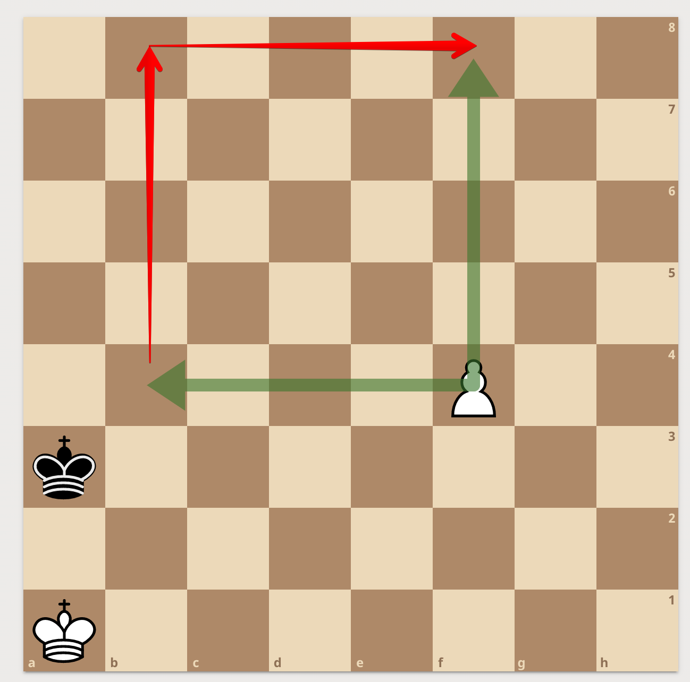

import PGN from '../src/components/PGN'

Aby wygrać samym pionkiem należy nie być w kwadracie przeciwnika. Tworzymy kwadrat z pionka i boków szachownicy.

Następnie zaczynamy:

* Jeżeli król jest poza kwadratem to idziemy do góry i zmieniamy się w hetmana [patrz tutaj](krol_i_hetman.md)
* Jeżeli jesteśmy w kwadracie staramy się z niego wyjść

Kwadrat:

<PGN>
[Event "?"]
[Site "?"]
[Date "2021.01.21"]
[Round "?"]
[White "?"]
[Black "?"]
[Result "*"]
[Annotator "Marcin"]
[SetUp "1"]
[FEN "8/8/8/8/5P2/k7/8/K7 w - - 0 1"]
[PlyCount "7"]
[SourceVersionDate "2021.01.21"]

{[%cal Gf4b4,Gb4b8,Ga3b4] [#] Kwadrat piona wyznaczaja punkty b4, b8, f4, f8.
ZASADA: JESLI KROL PRZECIWNIKA WEJDZIE DO KWARDATU, TO LAPIE PIONKA I TEN NIE
ZAMIENI SIE W HETMANA} 1. f5 {[%cal Gf5c5,Gc5c8,Ra3b4] biale zmniejszyly
kwadrat i krol nie moze do niego wejsc} Kb4 2. f6 {[%cal Gf6d6,Gd6d8]} Kc5 3.
f7 {[%cal Gf7e7,Ge7e8]} Kd6 4. f8=Q+ $18 *
</PGN>

## Kiedy zasada nie obowiązuje?

Zasada kwadratu nie obowiązuje (tak naprawdę kwadrat się zmniejsza o jedno pole).
Jeżeli na najkrótszej drodze króla stoi pion.

<PGN>
[Event "?"]
[Site "?"]
[Date "2021.01.21"]
[Round "?"]
[White "?"]
[Black "?"]
[Result "*"]
[Annotator "Marcin"]
[SetUp "1"]
[FEN "8/8/3p4/8/5P2/k7/8/K7 b - - 0 1"]
[PlyCount "8"]
[SourceVersionDate "2021.01.21"]

{[%csl Rd6][%cal Gf4b4,Gb4b8,Ra3f8] [#] Czarne wchodza do kwadratu, ale nie
lapia piona, bo na najkrotszej drodze stoi ich wlasny pion} 1... Kb4 2. f5 Kc5
3. f6 {[%cal Gf6d6,Gd6d8]} Kd5 4. f7 Ke6 5. f8=Q *
</PGN>
